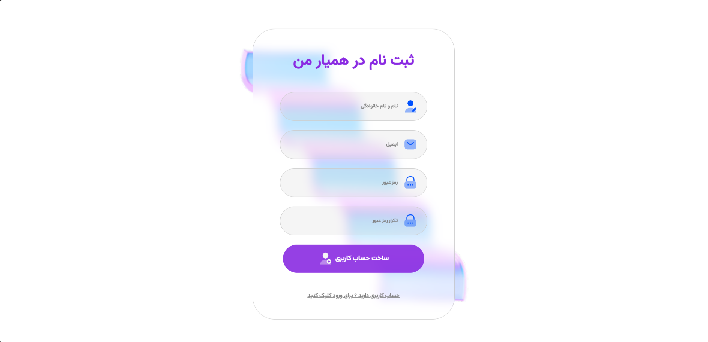

# CourseHub - Online Learning Platform Landing Page

A clean, modern landing page

Simple two-page project:
- Landing page introducing the platform and popular courses
- Sign Up / Login page 

Perfect as a starting point for a full course marketplace, learning management system (LMS) or educational platform.

## ✨ Features

- Modern, responsive landing page
- Combined Sign Up / Login form with tab switching
- Clean & minimal design (easy to customize)
- Mobile-friendly layout
- Ready for backend connection 

## 📸 Screenshots
**Landing Page**  

**Sign Up / Login Page**  

## 🛠️ Tech Stack
- HTML5
- CSS3
-  JavaScript for tab switching, form validation

